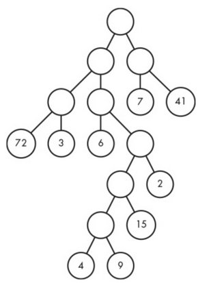

# Halloween Haul

## Problem

Consider this: it's Halloween, a holidat that often involves getting dressed up, candy from neighbots, and a stomachache. In this problem, you want to collect all the candy from a particular neighborhood as efficiently as possible. The neighborhood has a rigid though strange shape.

The circles with numbers in them are houses. Each number gives the amount of candy you'll get by visiting that house. Candy values are at most two digits. The circle at the top is your starting location. The circles without numbers are intersections between streets, where you choose which way to walk next. The lines that connect circles are the streets. Moving from one circle to another corresponds to walking one street.

Let's think abou how you could move through this neighborhood. Begin at the top circle. If you walk down the street on the right from that circle, you end up at a house and collect 41 pieces of candy. You could then walk back up the two streets to the top to return to your starting locaiton. You'll have thus walked a total of four streets and collected 41 pieces of candy.

However, your coal is to collect __all__ of the candy and to do so by walking the minimum number of streets. You're allowed to end your walk as soon as you've collected all the candy; there's no requirement to get back to the top circle.

## Input

The input consists of exactly five lines, where each line is a string of at most 255 characters that describes a neighborhood.

## Output

Our output will be five lines of text, with each line corresponding to one of the five input lines. EAch lines of output contains two integers separated by a space: the minimum number of streets walked to obtain all of the candy and the total amount of candy obtained.
